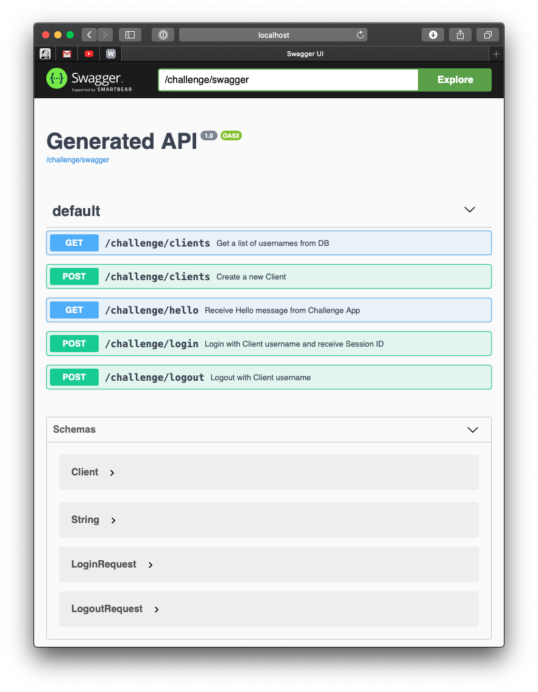

# hello-world-challenge

## Story

> **As a** user  
> **I want to** send Hello request  
> **So that** I am greeted by the app in response

## Run with Docker

TBD

## Run with Java

```
$ java -jar hello-world-challenge-runner.jar
```
By default, application runs on port `8080`

## Documentation

Swagger UI is available on 
```
http://localhost:8080/challenge/swagger-ui/
```
